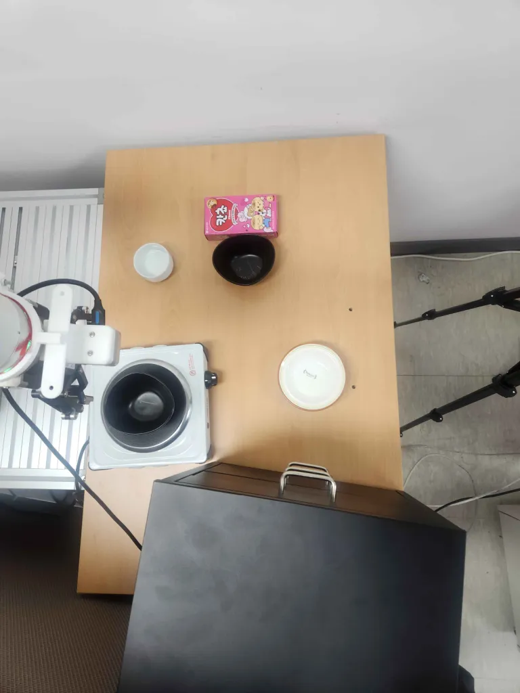

# FR5 GR00T Benchmark

FAIRINO FR5 실물에서 GR00T N1.7 파인튜닝 정책을 평가한 기록이다.
직접 만든 수동 리더암으로 205판을 수집해 학습하고, 물체 배치를 바꿔가며 30판을 평가한 뒤,
실행 계층 규칙을 하나씩 빼는 절제 실험까지 했다.

태스크는 LIBERO-Spatial task 0 을 실물로 옮긴 것이다.

```
pick up the black bowl next to the cookie box and place it on the plate
```

검은 그릇이 둘 있고(목표 그릇, 인덕션 위 방해 그릇) 쿠키 상자 옆 그릇을 골라야 한다.
접시는 목적지일 뿐 선택 기준이 아니다.



---

## 한눈에 보는 결과

| | |
|---|---|
| 데이터 | 205판 / 10,482 프레임 / 10 Hz |
| 정책 | GR00T N1.7, 6,000 스텝 파인튜닝 |
| **성공률** | **13 / 30 = 43.3 %** (배치를 판마다 변경) |
| 파지 성공 | 23 / 30 = 76.7 % |
| 주된 실패 | 이송 중 놓침 9, 헛잡음 7, 미해제 1 |
| 성패를 가르는 값 | 파지 후 테두리 **밀림** — 성공 2.8 mm, 실패 4.8 mm |
| 공간 추종 | 그릇이 10 cm 이동할 때 파지점은 3.5 cm 이동 |

같은 태스크의 Franka FR3 기록(30판, 53.3 %)과 성공률 구간이 겹친다. 다만 **실패가 일어나는
단계가 다르다** — FR3 는 파지 전 정체가 주된 실패였고, FR5 는 파지 이후 이송에서 잃는다.


---

## 문서

| | |
|---|---|
| [RESULTS.ko.md](RESULTS.ko.md) | 30판 평가 — 성공률, 단계, 실패 유형, 판별 표 |
| [docs/SETUP.md](docs/SETUP.md) | 로봇·그리퍼·카메라·좌표계, 텔레오퍼레이션 구성 |
| [docs/DATASET.md](docs/DATASET.md) | 205판 수집 절차, 액션 규약, 분포 통계 |
| [docs/TRAINING.md](docs/TRAINING.md) | 변환·학습 명령, 6,000 대 12,000 스텝 |
| [docs/ROLLOUT.md](docs/ROLLOUT.md) | 실행 경로와 하네스 규칙 여섯 가지, 그 근거 |
| [docs/ABLATION.md](docs/ABLATION.md) | 규칙을 하나씩 뺀 60판 |
| [docs/ROTATION.md](docs/ROTATION.md) | 회전 채널을 쓰지 않는 이유 — 진단 기록 |
| [docs/LIMITATIONS.md](docs/LIMITATIONS.md) | 미측정 항목과 한계 |
| [docs/ROADMAP.md](docs/ROADMAP.md) | 다음에 할 일 |

## 파일

```
data/   trials.csv          30판 판별 표
        layouts.csv         평가 배치 30세트 좌표
        ablation.csv        절제 실험 결과
        rotation_probe.csv  회전 디코딩 가설별 오차
fig/    fig1 ~ fig13        도표와 사진
tools/  bench_runner.py     평가 진행기 (키 하나씩 배치·실행·판정·기록)
        run_ablations.sh    절제 조건별 실행
        rot_diag.py         회전 라벨 진단 (데이터셋만 필요)
        probe_policy.py     정책 출력과 라벨 대조 (정책 서버 필요)
make_figures.py             결과 도표 생성
make_ablation_figures.py    절제·회전 도표 생성
```

도표를 다시 만들려면

```bash
python3 make_figures.py
python3 make_ablation_figures.py
```

---

## 관련 저장소

| | |
|---|---|
| [Franka-LiberoSpatial-Dataset](https://github.com/SungjinDavidLee/Franka-LiberoSpatial-Dataset) | 같은 태스크의 FR3(Franka) 데이터셋과 기술 가이드 |
| [Franka-RepExperiment-LiberoSpatial](https://github.com/SungjinDavidLee/Franka-RepExperiment-LiberoSpatial) | FR3 30판 평가 결과 — 이 저장소의 비교 대상 |
