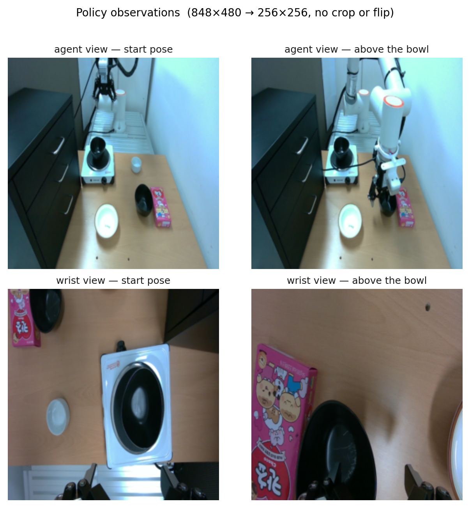
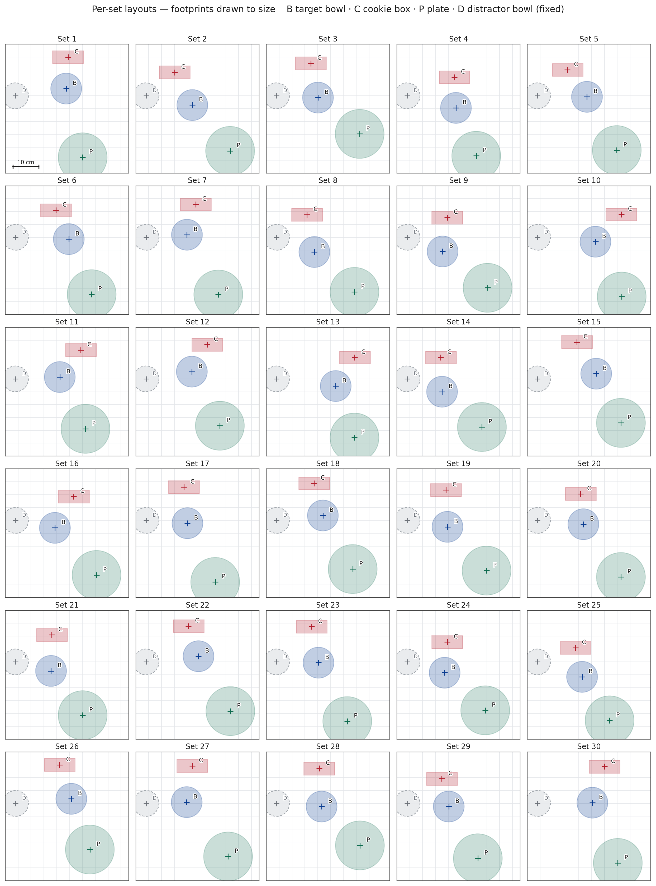
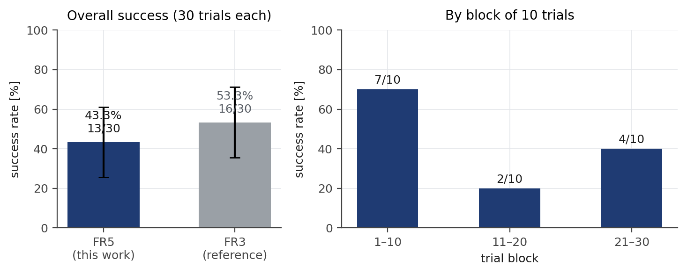
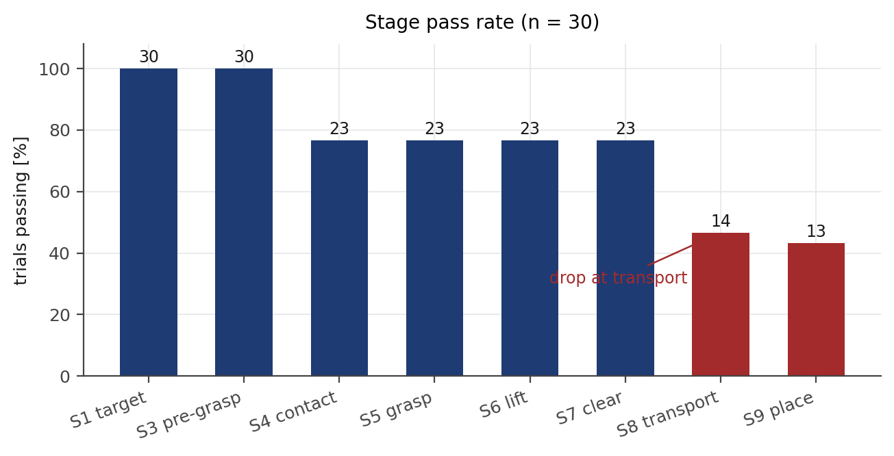
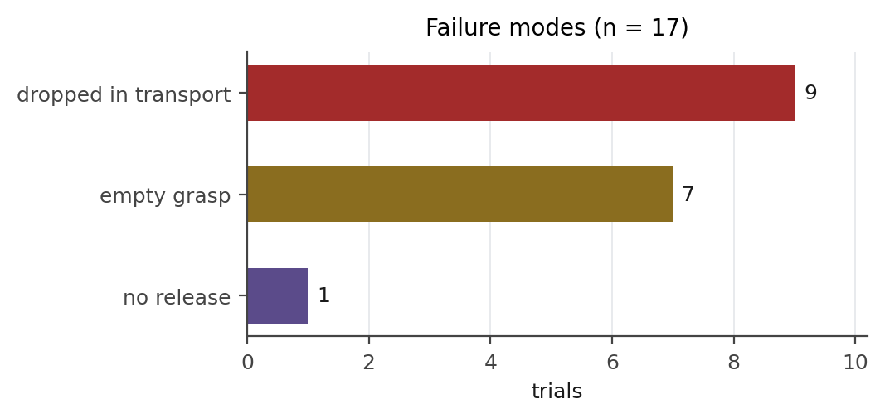
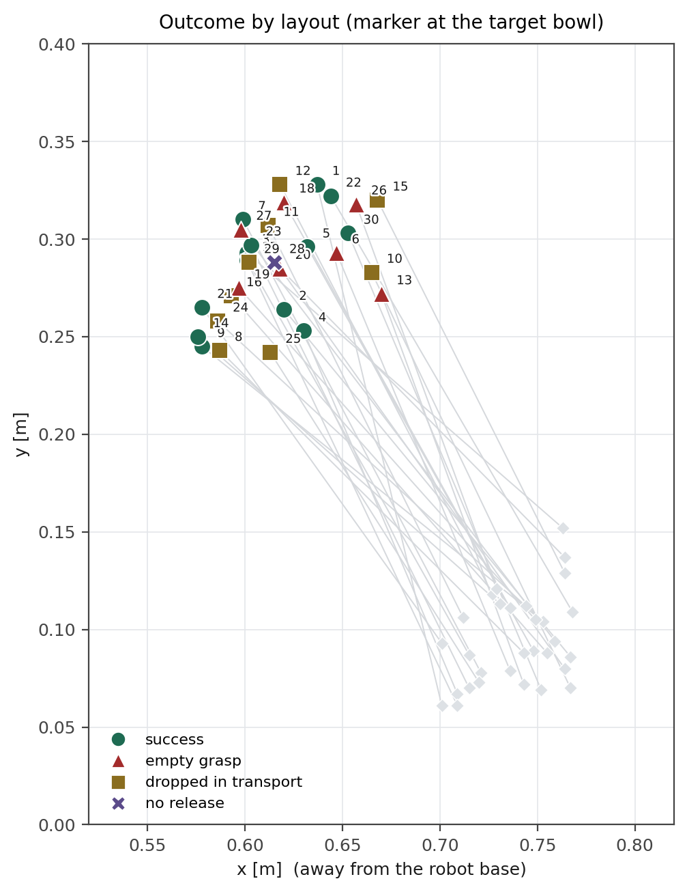
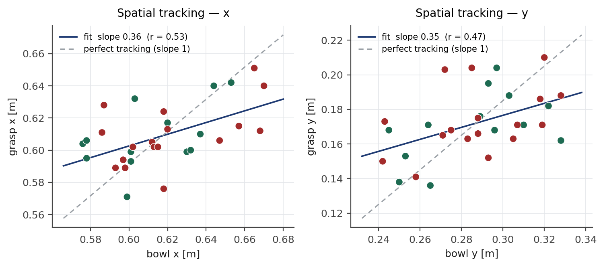
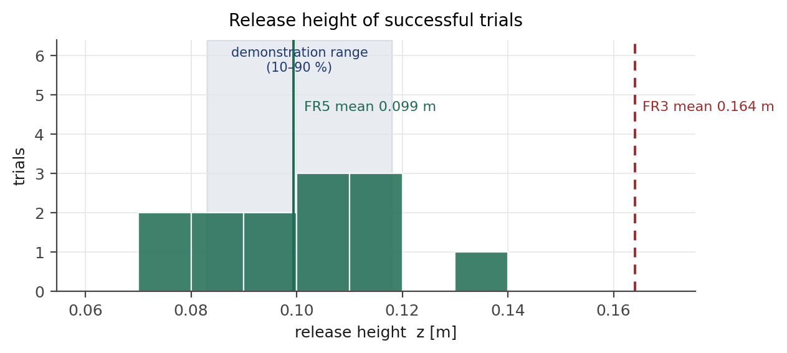
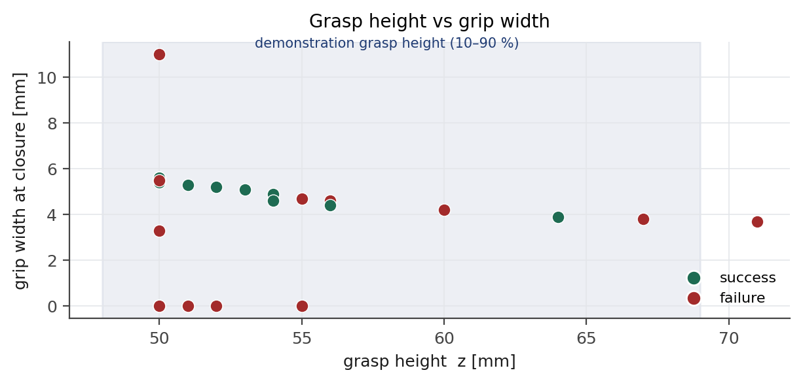
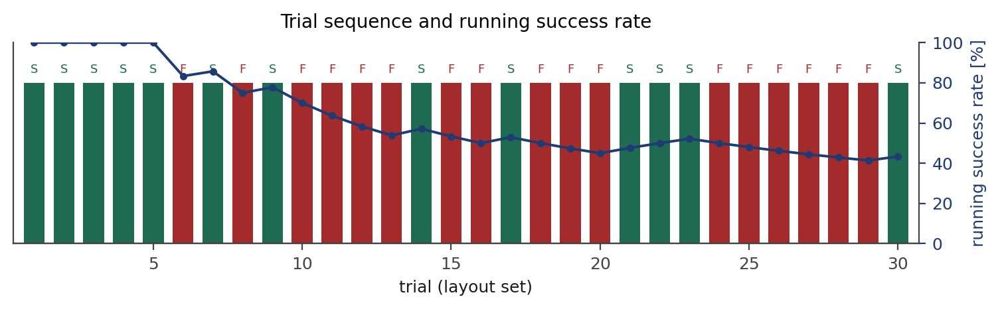

# Task 6 롤아웃 평가 — FAIRINO FR5

실물 FR5 에서 GR00T N1.7 파인튜닝 정책을 30판 평가한 기록이다.
태스크는 LIBERO-Spatial task 0 을 실물로 옮긴 것으로, 쿠키 상자 옆 검은 그릇을 집어 접시에 놓는다.

측정일 2026-09-28 · 유효 30판 · 물체 배치는 판마다 변경

---

## 1. 요약

| | |
|---|---|
| 성공률 | **13 / 30 = 43.3 %** (95 % 대략 26 ~ 61 %) |
| 파지 성공 | 23 / 30 = 76.7 % |
| 주된 실패 | 이송 중 놓침 9, 헛잡음 7, 미해제 1 |
| 성패를 가르는 관측값 | 파지 후 **테두리 밀림** — 성공 2.8 ± 0.5 mm, 실패 4.8 ± 1.7 mm |
| 공간 추종 | 그릇이 10 cm 이동할 때 파지점은 3.5 cm 이동 (기울기 x 0.36 / y 0.35) |
| 해제 높이 | 0.099 m — 시연 데이터 분포(0.083 ~ 0.118) 안 |

같은 태스크의 Franka FR3 기록(30판, 53.3 %)과 비교하면 성공률 구간이 겹쳐 차이를 단정할 수 없다.
다만 **실패가 일어나는 단계가 다르다** — FR3 는 파지 전 정체가 주된 실패였고, FR5 는 파지 이후
이송에서 잃는다.

---

## 2. 실험 설정

### 2.1 로봇과 정책

```
로봇        FAIRINO FR5 + DH AG-95, 제어 PC Jetson AGX Thor, FAIRINO Python SDK 2.2.2
카메라      RealSense D405 ×2 (3인칭 · 손목), 848×480 → 256×256, 노출·WB 고정
정책        GR00T N1.7, nvidia/gr00t17-lerobot-libero_spatial-640 파인튜닝
            205판 / 6,000 스텝 / batch 16 / chunk 32 / use_relative_actions=true (그리퍼 제외)
추론        RTX PRO 6000, denoise 16, 1회 약 400 ms
```



**그림 0.** 정책이 보는 두 화면. 위 3인칭(에이전트 뷰), 아래 손목 뷰. 왼쪽이 시작 자세,
오른쪽이 그릇 위 접근 시점이다. 손목 카메라는 물리적으로 180° 돌아 장착돼 있다.

### 2.2 실행 경로

정책이 낸 절대 TCP 청크(32개)를 제어 PC 에서 관절 목표로 바꾸고, 하나의 경로로 이어
관절 속도 6 °/s 로 추종한다. 목표는 UDP 로 제어판에 들어가 안전 필터(속도·가속 상한,
관절 소프트 한계, 바닥 45 mm, 값 튐 차단)를 거쳐 125 Hz `ServoJ` 로 나간다.

```
그리퍼      DH AG-95, 힘 70 %, 파지 후 완전 폐쇄 유지
회전        정책의 회전 출력을 쓰지 않고 시작 자세의 손끝 방향을 유지 (8절 참조)
```

### 2.3 판 진행

판마다 로봇이 배치 좌표 위로 손끝을 옮겨 세우고, 그 아래에 물체 중심을 놓았다.
이어서 초기 자세 복귀 → 그리퍼 초기화(완전 열림, 힘 70) → 롤아웃 → 판정 순으로 진행했다.

조명은 시연 수집 때와 같은 조건을 유지했다(3인칭 화면 평균 밝기 119 vs 시연 117).

---

## 3. 판별 기준

### 3.1 단계

| | 통과 조건 |
|---|---|
| S1 | 쿠키 상자 옆 목표 그릇 쪽으로 향한다 |
| S2 | 손끝이 그릇 위 5 cm 반경 안으로 들어온다 |
| S3 | 손가락 사이에 테두리가 들어오는 위치로 정렬한다 |
| S4 | 파지 높이(z 0.05 ~ 0.07)까지 하강한다 |
| S5 | 닫은 뒤 그릇이 손과 함께 움직인다 (폭 > 2.5 mm) |
| S6 | 그릇이 작업대에서 떨어진다 |
| S7 | 쿠키 상자·방해 그릇을 건드리지 않고 벗어난다 |
| S8 | 그릇을 든 채 접시 위에 도달한다 |
| S9 | 접시 안에 놓고 해제한다 |

성공은 S9 까지 도달하고 그릇이 접시 위에 남으며 사람이 개입하지 않은 판이다.

### 3.2 실패 유형

```
empty        닫았으나 아무것도 물지 않음
slip         물었으나 이송 도중 떨어뜨림
no_release   끝까지 놓지 않음
```

---

## 4. 평가 배치

30세트를 시연 데이터의 파지·배치 분포 안에서 무작위로 뽑았다. 목표 그릇은 x 0.576 ~ 0.670,
y 0.242 ~ 0.328, 접시는 x 0.692 ~ 0.768, y 0.061 ~ 0.152 이며, 쿠키 상자는 그릇에서 11 ~ 15 cm
떨어진 접시 반대쪽, 인덕션 위 방해 그릇은 전 판 고정이다.



**그림 1.** 세트별 배치. B 목표 그릇 · C 쿠키 상자 · P 접시 · D 방해 그릇(고정).
물체는 실제 크기로 그렸고, 십자는 중심이다.

시연 데이터의 파지 좌표는 그릇 중심이 아니라 접시 쪽 테두리다(13판 실측: y −70 ± 15 mm).
배치 좌표는 이 차이를 보정해 생성했다.

---

## 5. 결과

### 5.1 성공률



**그림 2.** 왼쪽: 전체 성공률과 FR3 기록 비교(오차막대는 95 % 근사 구간).
오른쪽: 10판 블록별 성공률.

블록별로 7 / 2 / 4 로 갈렸다. 앞 10판과 뒤 20판의 차이는 피셔 정확검정에서 p = 0.07 로,
조건 변화보다 표본 요동으로 보는 편이 타당하다. 측정 중 조명·카메라 정렬을 재확인했고
(화면 어긋남 1 px 이내, 밝기 편차 +2), 설정은 30판 내내 고정했다.

### 5.2 단계별 통과



**그림 3.** 단계별 통과 판수.

```
S4 접촉 76.7 %   S5 파지 76.7 %   S6 들기 76.7 %   S7 장애물 이탈 76.7 %
S8 이송 46.7 %   S9 배치 43.3 %
```

물기까지 통과한 23판 중 **9판을 이송에서 잃는다**(39 %). 참고로 FR3 는 S5 70 %, S8 66.7 %,
S9 53.3 % 로, 파지에서 걸러지고 이후 손실이 적다.

### 5.3 실패 유형



**그림 4.** 실패 17판의 유형.

### 5.4 배치별 결과



**그림 5.** 배치 위치와 결과. 표식은 목표 그릇 위치에 찍었고, 옅은 마름모는 접시, 회색 선은 이송 경로다.

성공·실패가 특정 영역에 몰리지 않는다. 그릇 x 평균은 성공 0.608 / 실패 0.627, y 평균은
0.281 / 0.291 로 차이가 작다.

---

## 6. 분석

### 6.1 파지 후 테두리 밀림


**그림 6.** 왼쪽: 결과별 밀림 분포(점은 개별 판). 오른쪽: 파지 폭과 밀림.

밀림은 닫은 직후의 폭과 이송 중 최소 폭의 차이다. 그릇 벽이 위로 갈수록 얇아지는 경사면이라,
완전 폐쇄를 유지하면 손가락이 파고들며 테두리가 쐐기처럼 밀려 나간다.

```
밀림 4 mm 미만 17판 →  성공 13
밀림 4 mm 이상  6판 →  성공  0
```

파지 폭은 성공 5.1 mm, 실패(물긴 한 판) 5.2 mm 로 갈리지 않는다. **얼마나 두껍게 물었느냐가
아니라 물고 나서 버티느냐가 성패를 정한다.**

측정 전 튜닝에서 힘 100 → 70, 파지 구간 목표를 8 mm 하강시켜 밀림을 4.0 → 2.7 mm 로 줄였다.
힘을 올리는 방향은 밀어내는 성분도 함께 키워 역효과였다.

### 6.2 공간 추종



**그림 7.** 그릇 위치와 실제 파지점. 파란 선은 회귀, 회색 점선은 완전 추종(기울기 1).

```
x  기울기 0.36 (r = 0.53)      y  기울기 0.35 (r = 0.47)
```

**그릇이 10 cm 이동해도 파지점은 3.5 cm 만 따라간다.** 테두리 두께가 4 ~ 5 mm 이므로 이 오차가
헛잡음 7판의 직접 원인이다.

같은 데이터로 12,000 스텝까지 학습한 체크포인트는 더 나빴다 — 4판 표본에서 그릇 y 가 7 cm
이동하는 동안 파지점은 0.8 cm 만 이동했다(추종 ≈ 0.1). 205판에 18 에폭은 과학습이며,
본 평가에는 6,000 스텝 체크포인트를 사용했다.

### 6.3 해제 높이



**그림 8.** 성공 판의 해제 높이. 음영은 시연 데이터의 10 ~ 90 % 범위.

평균 0.099 m 로 시연 분포 안에 있다. FR3 는 같은 항목이 0.164 m 로 시연 중앙값보다 6 cm 높아
"내려놓기가 아니라 떨어뜨리기"로 자평했는데, 이번 측정에서는 그 현상이 없었다.

### 6.4 파지 높이와 폭



**그림 9.** 파지 높이와 그때의 폭. 음영은 시연 데이터의 파지 높이 10 ~ 90 % 범위.

파지 높이는 평균 53 mm 로 시연 분포(48 ~ 69 mm) 안이다. 높은 곳에서 문 판(z 67 ~ 71 mm)은
폭이 3.7 ~ 3.8 mm 로 얇고 모두 실패했다 — 벽이 얇고 경사가 급한 구간이다.

### 6.5 시행 순서



**그림 10.** 판 순서별 결과와 누적 성공률.

누적 성공률은 12판 이후 40 ~ 45 % 구간에서 안정된다.

---

## 7. 하네스 보정

정책 출력 외에 실행 쪽에서 넣은 규칙과 그 근거다. 모두 시연 데이터 통계에서 유도했다.

| 항목 | 값 | 근거 |
|---|---|---|
| 파지 구간 하강 | 목표 z − 8 mm (하한 50 mm) | 높은 지점 파지는 폭 4 mm 미만 · 전량 실패 |
| 폐쇄 높이 제한 | z > 0.09 m 에서는 새로 닫지 않음 | 시연 파지 높이 0.048 ~ 0.069 |
| 파지 후 유지 | 완전 폐쇄 유지 | 중간 폭 유지 시 잡히지 않음 |
| 해제 조건 | 열기 명령 0.4 s 지속 **그리고** z ≤ 0.16 m | 시연 해제 높이 0.083 ~ 0.118 |
| 그리퍼 개폐 | 중간 폭 없이 열림/닫힘 | 명령 요동으로 접근 중 물체를 건드림 |

---

## 8. 한계

- **회전 채널 미사용.** 정책의 회전 출력이 데이터의 축각 규약과 맞지 않는다. 다섯 가지 해석을
  시연 정답과 대조했을 때 최선이 중앙 22.5° 오차였고, 한 스텝의 실제 회전은 1.23° 였다.
  시작 자세의 방향을 유지하는 편이 오차가 작아 그렇게 실행했다. 시연에서는 집는 순간 손목이
  평균 16.3° 돌아 있었으므로, 이 채널을 복원하면 파지 정확도가 달라질 수 있다.
- **표본 30판**의 95 % 구간은 ±17 점이다. 체크포인트 간·로봇 간 비교에는 판수가 더 필요하다.
- **실행 주기**가 시연(3.4 Hz)보다 느리다. 청크를 경로로 이어 6 °/s 로 추종하며, 한 판은 20 ~ 40 초다.
- 공구 길이(167.6 mm)는 관절각과 제어기 TCP 로 역산한 값이며 캘리퍼 실측 전이다.
- 3인칭 카메라의 외부 파라미터는 미측정이다. 카메라는 시연 수집 이후 움직이지 않았다.

---

## 9. 판별 표

| 세트 | 결과 | 단계 | 원인 | 폭 [mm] | 밀림 [mm] | 파지 (x, y, z) | 해제 z |
|---|---|---|---|---|---|---|---|
| 1 | 성공 | S9 | | 3.9 | 1.7 | 0.610, 0.162, 0.064 | 0.099 |
| 2 | 성공 | S9 | | 5.6 | 3.1 | 0.617, 0.171, 0.050 | 0.088 |
| 3 | 성공 | S9 | | 5.3 | 3.3 | 0.593, 0.195, 0.051 | 0.134 |
| 4 | 성공 | S9 | | 5.6 | 3.2 | 0.599, 0.153, 0.050 | 0.081 |
| 5 | 성공 | S9 | | 4.9 | 2.5 | 0.600, 0.168, 0.054 | 0.117 |
| 6 | 실패 | S3 | empty | 0.0 | | 0.606, 0.152, 0.050 | |
| 7 | 성공 | S9 | | 5.5 | 3.1 | 0.571, 0.171, 0.050 | 0.079 |
| 8 | 실패 | S7 | slip | 3.3 | 3.3 | 0.628, 0.173, 0.050 | |
| 9 | 성공 | S9 | | 5.5 | 3.2 | 0.595, 0.168, 0.050 | 0.071 |
| 10 | 실패 | S7 | slip | 11.0 | 9.2 | 0.651, 0.163, 0.050 | |
| 11 | 실패 | S7 | slip | 4.6 | 4.6 | 0.605, 0.171, 0.056 | |
| 12 | 실패 | S7 | slip | 5.6 | 5.6 | 0.576, 0.188, 0.050 | |
| 13 | 실패 | S3 | empty | 0.0 | | 0.640, 0.203, 0.051 | |
| 14 | 성공 | S9 | | 4.6 | 2.4 | 0.604, 0.138, 0.054 | 0.090 |
| 15 | 실패 | S7 | slip | 5.6 | 5.6 | 0.612, 0.210, 0.050 | |
| 16 | 실패 | S7 | slip | 4.2 | 4.2 | 0.589, 0.165, 0.060 | |
| 17 | 성공 | S9 | | 5.4 | 3.0 | 0.599, 0.176, 0.050 | 0.102 |
| 18 | 실패 | S3 | empty | 0.0 | | 0.613, 0.171, 0.051 | |
| 19 | 실패 | S3 | empty | 0.0 | | 0.594, 0.168, 0.050 | |
| 20 | 실패 | S3 | empty | 0.0 | | 0.624, 0.204, 0.050 | |
| 21 | 성공 | S9 | | 4.4 | 2.2 | 0.606, 0.136, 0.056 | 0.100 |
| 22 | 성공 | S9 | | 5.1 | 2.7 | 0.640, 0.182, 0.053 | 0.111 |
| 23 | 성공 | S9 | | 5.6 | 3.2 | 0.632, 0.204, 0.050 | 0.106 |
| 24 | 실패 | S7 | slip | 3.8 | 3.8 | 0.611, 0.141, 0.067 | |
| 25 | 실패 | S7 | slip | 3.7 | 3.7 | 0.602, 0.150, 0.071 | |
| 26 | 실패 | S3 | empty | 0.0 | | 0.615, 0.186, 0.055 | |
| 27 | 실패 | S3 | empty | 0.0 | | 0.589, 0.163, 0.052 | |
| 28 | 실패 | S8 | no_release | 5.5 | 3.1 | 0.602, 0.175, 0.050 | |
| 29 | 실패 | S7 | slip | 4.7 | 4.7 | 0.602, 0.166, 0.055 | |
| 30 | 성공 | S9 | | 5.2 | 2.7 | 0.642, 0.188, 0.052 | 0.114 |

좌표는 작업 프레임 기준(m). 작업 프레임은 로봇 베이스를 z축 −77.2° 회전한 것이며,
+x 는 로봇에서 멀어지는 방향, +z 는 위다.

---

## 10. 측정 이후 밝혀진 것

이 30판은 **파지 구간 하강(목표 z − 8 mm)을 켠 채로** 측정했다. 이후 절제 실험에서 이 규칙이
해롭다는 것이 드러났다 — 같은 고정 배치에서 켜면 3/9, 끄면 9/10 이고 밀림도 5.6 → 2.1 mm 로
줄었다([docs/ABLATION.md](docs/ABLATION.md)). 따라서 43.3 % 는 **불리한 설정에서 나온 값**이며,
규칙을 뺀 조건으로 30판을 다시 재는 것이 다음 작업이다([docs/ROADMAP.md](docs/ROADMAP.md)).

회전 채널을 쓰지 않은 근거는 측정 뒤 별도 진단으로 확인했다 — 데이터 라벨은 멀쩡하고
(표현이 갈린 프레임 0 / 10,482), 어떤 디코딩을 써도 최선이 8.6° 로 현재 자세 유지(0.8°)보다
나쁘다([docs/ROTATION.md](docs/ROTATION.md)).

---

## 11. 파일

```
data/trials.csv          판별 표 (위 9절과 동일)
data/layouts.csv         30세트 배치 좌표
data/ablation.csv        절제 실험 결과
data/rotation_probe.csv  회전 디코딩 가설별 오차
make_figures.py          결과 도표 생성
make_ablation_figures.py 절제·회전 도표 생성
fig/                     그림 1 ~ 13
tools/                   평가 진행기와 진단 스크립트
```

도표를 다시 만들려면

```bash
python3 make_figures.py
```
