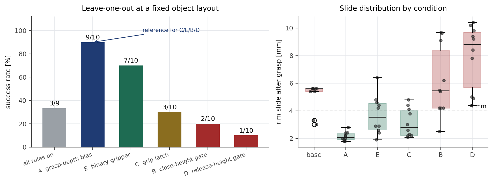

# 절제 실험 — 규칙을 하나씩 빼기

실행 계층 규칙 여섯 가지가 각각 무엇을 막고 있는지 보기 위해, 하나씩 끄고 10판씩 돌렸다.
**물체 배치는 고정**이고 나머지 설정은 전부 같다.



| 조건 | 성공 | 밀림 중앙 | 무엇이 무너지나 |
|---|---|---|---|
| 모든 규칙 적용 (파지 하강 포함) | 3/9 | 5.6 mm | 파지 높이가 바닥 하한에 눌려 두꺼운 벽을 문다 |
| **A 끄기 — 파지 구간 하강 없음** | **9/10** | **2.1 mm** | — (끄는 쪽이 낫다) |
| E 끄기 — 중간 폭 그대로 | 7/10 | 3.5 mm | 영향이 작다 |
| C 끄기 — 파지 후 잠금 없음 | 3/10 | 2.8 mm | 이송 중 그리퍼가 벌어져 떨어뜨린다 |
| B 끄기 — 폐쇄 높이 제한 없음 | 2/10 | 5.4 mm | 아무 높이에서나 닫아 두껍게 문다 |
| D 끄기 — 해제 높이 제한 없음 | 1/10 | 8.8 mm | 공중에서 놓아 떨어뜨린다 |
| F 끄기 — 정책 회전 사용 | 실행 불가 | — | 목표가 전량 기각된다 (아래) |

## 읽기

**A(파지 구간 하강)는 해로운 규칙이었다.** 처음에는 한두 판만 보고 "깊게 물면 덜 미끄러진다"고
판단해 넣었는데, 10판으로 재니 뒤집혔다. 8 mm 를 더 내리면 바닥 하한(50 mm)에 눌려 파지
높이가 고정되고, 벽의 두꺼운 구간을 물어 밀림이 커진다.

```
A 켬    파지 높이 50 mm 고정,  폭 5.4~5.6 mm,  밀림 5.6 mm,  3/9
A 끔    파지 높이 53~67 mm,    폭 3.8~5.1 mm,  밀림 2.1 mm,  9/10
```

**30판 본 측정은 A 를 켠 채로 돌렸다.** 즉 공개한 43.3 % 는 불리한 설정에서 나온 값이다.

**C·B·D 는 필요하다.** 셋 다 빼면 10~30 % 로 떨어지고, 실패 양상이 규칙이 막으려던 것과
정확히 일치한다 — C 는 이송 중 벌어짐, B 는 잘못된 높이에서의 폐쇄, D 는 공중 해제.

**E 는 영향이 작다.** 7/10 으로 기준과 비슷하다. 접근 중 떨림을 줄이는 효과는 있지만
성공률을 좌우하지는 않는다.

## F — 정책 회전을 쓰면 한 스텝도 실행되지 않는다

한 판에서 중단했다. 청크 32개 목표가 **전량 기각**되었고 사유가 모두 같다.

```
step 0 k0:  건너뜀 (IK 오차 0.00 mm, 관절 변화 281.3도)
step 0 k1:  건너뜀 (IK 오차 0.00 mm, 관절 변화 171.6도)
...
step 0:     쓸 수 있는 목표가 없다
```

IK 오차가 0 이므로 그 자세 자체는 도달 가능하지만, 거기 가려면 손목을 뒤집어야 한다.
자세한 진단은 [ROTATION.md](ROTATION.md).

## 주의

- 한 조건이 10판이라 성공률의 95 % 구간이 ±30 점이다. **작은 차이는 주장하지 않는다.**
  C·B·D 처럼 기준의 절반 이하로 떨어지는 경우만 효과로 읽었다.
- 블록 사이에 물체를 다시 놓는 과정에서 고정 배치가 조금씩 달라졌다. 파지 폭이 블록마다
  4.3 ~ 8.4 mm 로 흔들린 것이 그 흔적이다. 그래서 기준 블록을 마지막에 다시 측정해
  같은 배치에서 비교했다.
