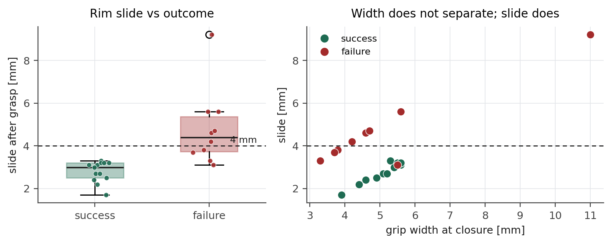

# 롤아웃

## 1. 실행 경로

```
정책 서버(학습 서버)  ──HTTP──▶  롤아웃(제어 PC)  ──UDP──▶  제어판 안전 필터  ──ServoJ 125Hz──▶  FR5
```

정책이 낸 절대 TCP 청크 32개를 제어 PC 에서 역기구학으로 관절 목표로 바꾼다. 그다음이
중요한데, 목표를 **하나씩 던지고 도착을 기다리는 대신 32개를 하나의 경로로 이어** 일정한
관절 속도(6 °/s)로 따라간다.

점마다 멈췄다 출발하면 매 단계 가속·감속이 일어나 로봇과 고정대가 흔들린다. 경로로 이으면
목표의 순간 속도가 평균 5.8, 최대 6.0 °/s 로 거의 일정하다.

예외는 파지 순간이다. 닫으라는 명령이 나오면 팔을 세우고 그리퍼를 기다린다(2.0 s).

## 2. 하네스 규칙 여섯 가지

정책 출력 외에 실행 계층에서 넣은 규칙이다. **모두 수집 데이터 통계에서 유도했고**,
특정 시행의 물체 위치에서 유도한 보정은 쓰지 않았다.

| | 규칙 | 값 | 근거 |
|---|---|---|---|
| A | 파지 구간 하강 | **사용 안 함** | 넣으면 바닥 하한에 눌려 더 두꺼운 벽을 물게 된다 (절제 실험) |
| B | 폐쇄 높이 제한 | z > 0.09 m 에서는 새로 닫지 않음 | 시연 파지 높이 0.048 ~ 0.069 |
| C | 파지 후 잠금 | 쥔 뒤 완전 폐쇄 유지 | 이송 중 벌어져 떨어뜨림 |
| D | 해제 조건 | 열기 명령 0.4 s 지속 **그리고** z ≤ 0.16 m | 시연 해제 높이 0.083 ~ 0.118 |
| E | 그리퍼 개폐 | 중간 폭 없이 열림/닫힘 | 폭 명령 요동으로 접근 중 물체를 건드림 |
| F | 회전 | 정책의 회전 출력을 쓰지 않고 시작 자세 유지 | [ROTATION.md](ROTATION.md) |

각 규칙을 하나씩 뺀 결과는 [ABLATION.md](ABLATION.md) 에 있다.

## 3. 측정에 쓴 설정

```
체크포인트   fr5_task6_abs / 006000
그리퍼       힘 70 %,  시작 완전 열림
경로 속도    6 °/s,  청크 32개를 한 경로로
안전 필터    배율 x1.0,  속도 15,  가속 120 °/s²,  바닥 하한 45 mm
종료 조건    놓으면 종료 / 쥔 뒤 폭이 1.5 mm 아래로 0.6 s 이상이면 "놓침"으로 종료 / 80 스텝 초과
```

## 4. 왜 힘을 올리면 안 되는가

그릇 벽은 위로 갈수록 얇아지는 경사면이다. 잡은 뒤에도 완전 폐쇄를 유지하므로 손가락이
계속 파고드는데, 경사면을 조이면 테두리가 **쐐기처럼 밀려 나간다.** 힘을 키우면 미는 성분도
같이 커진다.

실제로 힘 100 에서 미끄러졌고, 70 으로 낮춘 뒤 밀림이 줄었다. 레지스터를 직접 읽어
설정값이 들어가 있음을 확인한 상태에서 측정했다.

```
밀림 = 닫은 직후의 폭 − 이송 중 최소 폭
성공 판 2.8 ± 0.5 mm       실패 판 4.8 ± 1.7 mm
4 mm 미만 17판 → 성공 13      4 mm 이상 6판 → 성공 0
```



## 5. 평가 진행기

`tools/bench_runner.py` 가 배치 안내 → 초기화 → 롤아웃 → 판정 → 기록을 키 하나씩으로 묶는다.

```bash
LATCH_MODE=full GRASP_DZ=0 python3 tools/bench_runner.py --tag main --from 1 --to 30 --force-cycle 70
```

```
대기 화면   p 배치 안내(손끝이 좌표를 짚어준다)  g 그리퍼 초기화  h 초기 자세  s 시작  k 건너뛰기  q 종료
진행 중     e 지금 끝내기
판정        s 성공 / f 실패 / x 무효  →  실패면 단계 1~9, 원인 a~e
```

배치는 **로봇이 좌표 위에 손끝을 세워주고 그 아래에 물체 중심을 놓는** 방식이다.
도면만 보고 눈으로 맞추면 체계적으로 어긋난다(초기 10판에서 y 로 9 cm 치우쳤다).
