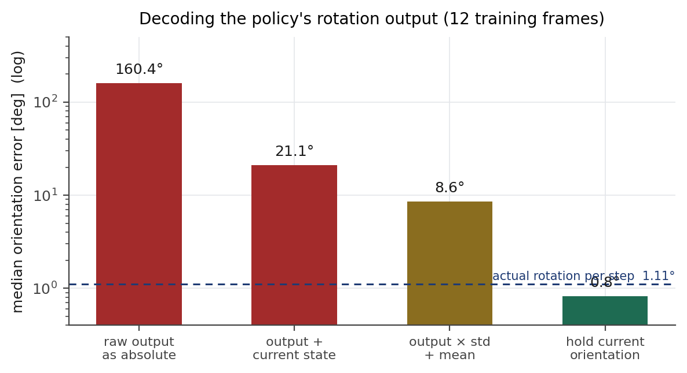

# 회전 채널 — 왜 쓰지 않는가

롤아웃은 정책의 회전 출력을 버리고 **시작 자세의 손끝 방향을 유지**한다. 임시방편이 아니라
세 단계의 진단을 거쳐 내린 결론이다.



## 1. 증상

정책이 내는 회전의 축각 크기가 **0.388 rad (22°)** 로 거의 고정인데, 데이터 라벨은 **3.15 rad
(180°)** 다. 이 출력을 그대로 목표로 쓰면 공구가 뒤집힌 자세가 되고, 거기 가려면 관절이
170~280° 움직여야 해서 안전 필터가 전량 기각한다.

## 2. 데이터는 깨끗하다

축각은 같은 회전을 두 가지로 적을 수 있고(축 n 으로 θ, 축 −n 으로 2π−θ), 크기가 π 근처면
프레임마다 표현이 갈릴 수 있다. 이 태스크의 자세가 정확히 그 자리에 있어 의심했다.

205판 전체를 검사한 결과 (`tools/rot_diag.py`):

```
축각 크기 |aa|       p5 3.007   p50 3.138   p95 3.278      π 초과 프레임 47.4 %
한 판 안에서 π 를 넘나드는 판   196 / 205
프레임 사이 실제 회전각        p50 1.11°   p95 4.48°
라벨 차분 ‖Δaa‖              p50 1.47°   p95 6.47°
표현이 갈린 프레임            0개 (0.00 %)
action[t] 와 state[t+1][:7]  최대 차이 0.000000
```

**라벨은 멀쩡하다.** π 를 넘나드는 데이터인데도 차분이 한 번도 튀지 않았다 — 정규화가
제대로 작동하고 있다.

## 3. 디코딩을 바꿔도 쓸모가 없다

학습 프레임 12개를 정책에 되먹여, 출력을 세 가지로 해석해 라벨 자세와 비교했다
(`tools/probe_policy.py`).

| 해석 | 중앙 오차 |
|---|---|
| 출력을 그대로 절대 축각으로 | 160.4° |
| 출력 + 현재 상태 회전 (상대값 가정) | 21.2° |
| 출력 × std + mean (역정규화) | 8.6° |
| **현재 자세 유지 (지금 쓰는 방식)** | **0.8°** |

역정규화가 가장 그럴듯한 해석이지만(160° → 8.6°), 그래도 **아무것도 하지 않는 것보다
10배 나쁘다.**

이유는 태스크에 있다. 이 작업에서 회전은 한 스텝에 1.11° 밖에 변하지 않고, 전체 분포의
표준편차가 0.19 ~ 0.22 rad(11~13°)다. 모델 출력은 평균에서 0.4 표준편차 떨어진 값이라
사실상 **평균을 예측하고 있다.** 신호(1.1°)보다 오차(8.6°)가 크면 정보가 없는 채널이다.

위치 채널은 정상이다 — 같은 프레임에서 재현 오차 **중앙 30.6 mm** 로, FR3 쪽 기록(28.3 mm)과
같은 수준이다.

## 4. 결론

```
회전 고정은 데이터나 라벨의 결함 때문이 아니라,
이 태스크에서 회전이 거의 변하지 않아 학습 신호가 없기 때문이다.
```

회전 채널을 검증하려면 **회전이 실제로 변하는 태스크**(기울여 붓기, 각도 있는 삽입)가 필요하다.
덧붙여 FR3 쪽도 회전 명령을 보내지 않는데, 그쪽은 Cartesian 속도 컨트롤러가 회전 성분을
폐기하는 구조라 이유가 다르다.

## 5. 재현

```bash
# 데이터셋만 있으면 된다 (GPU 불필요)
python3 tools/rot_diag.py --root ~/.cache/huggingface/lerobot/local/fr5_task6_abs --plot

# 정책 서버가 떠 있는 상태에서
python3 tools/probe_policy.py --n 12
```
